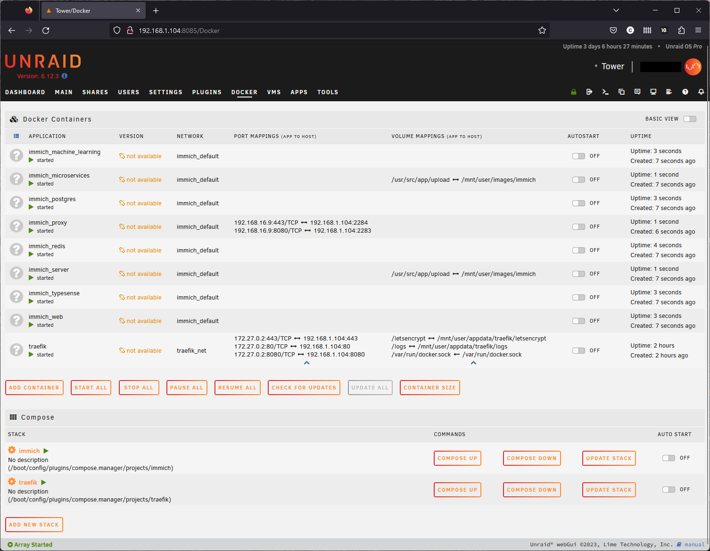
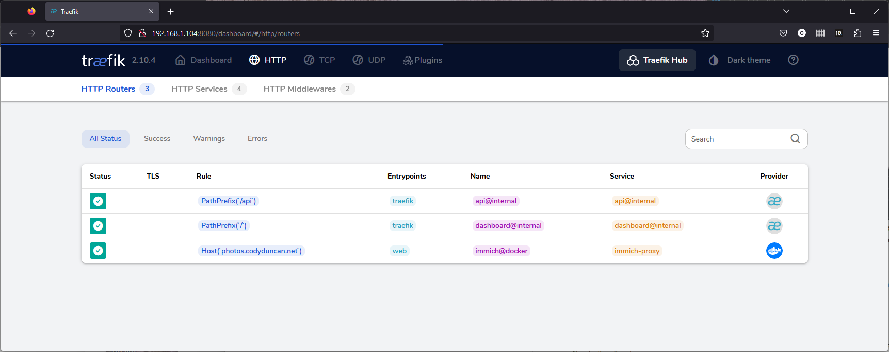
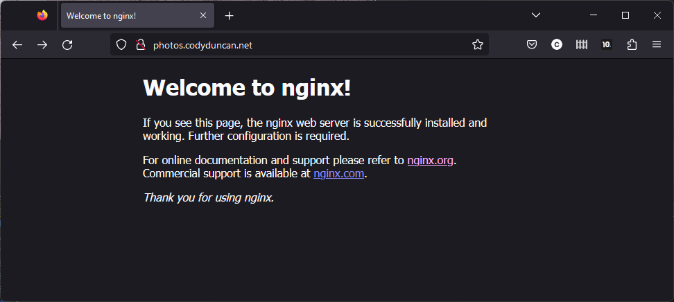
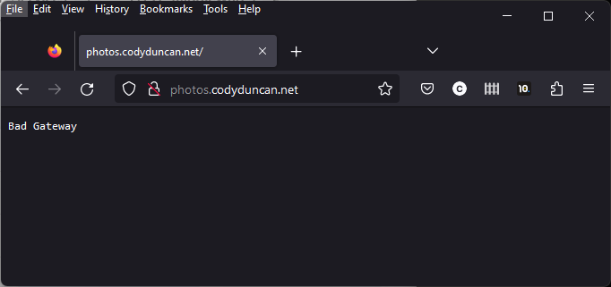
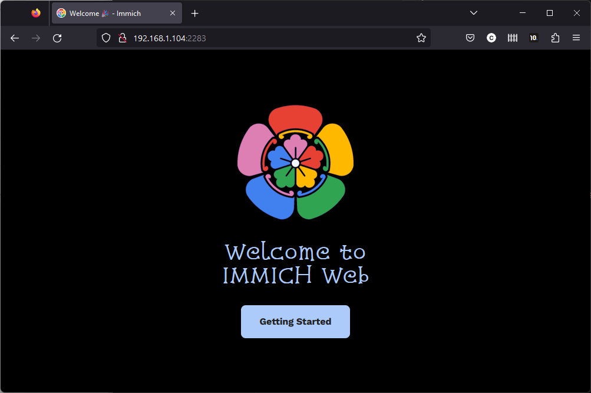
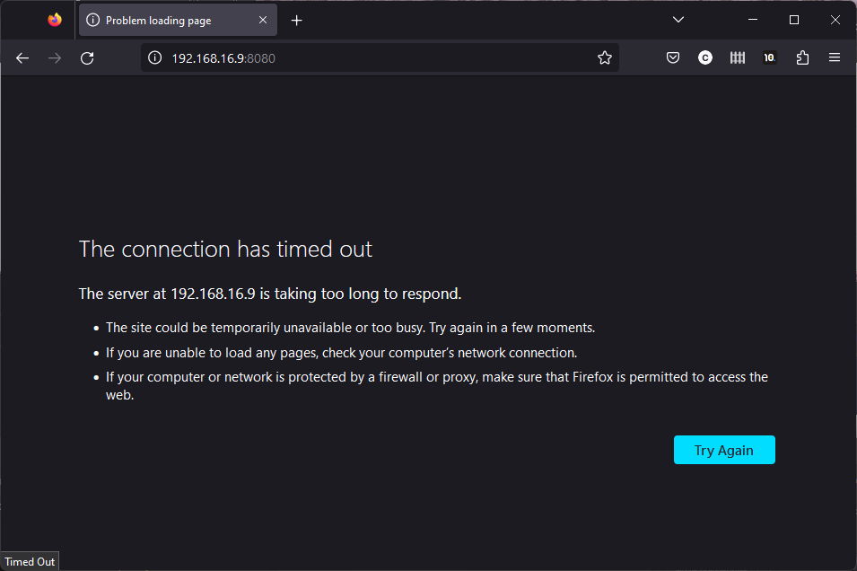

# immich_config_help
Sharing my configuration files because I need help figuring them out.

# Goal
Setup `immich` as a photo sharing website. I'd like to share my good photos with friends and people that I meet.

Using
- [Unraid](https://unraid.net/) - OS and Docker platform
- [Traefik](https://doc.traefik.io/traefik/) - Reverse-Proxy to forward requests to the web server and handle SSL certification and generation via Automated Certificate Management Environment (ACME) protocol.
- [Let's Encrypt](https://letsencrypt.org/) - SSL Certificate Authority and ACME protocol provider.
- [Cloudflare](https://www.cloudflare.com/) - DNS provider and handles challenging the SSL certificate.
- [Cloudflare Tunnel](https://www.cloudflare.com/products/tunnel/) - Tunnel to hide my public IP.
- [Immich](https://immich.app/) - Self-Hosted Photo sharing website

## Roadmap
1. ✅ Setup `immich` on `unraid`
    - [Tutorial](https://documentation.immich.app/docs/install/unraid) Complete. Can see Immich from local network 
2. ✅ Setup `traefik` on `unraid`
    - [Tutorial](https://doc.traefik.io/traefik/user-guides/docker-compose/basic-example/) Complete. Can se whoami from local network.
3. ✅ Setup `traefik` with `Let's Encrypt` to handle SSL Certification so the website can be https.
    - [Tutorial](https://doc.traefik.io/traefik/user-guides/docker-compose/acme-dns/) Complete. Can see whoami from local network with successful https certification.
4. ✅ Setup `traefik` as the reverse proxy in front of `immich_proxy` container, as described in [immich's documentation](https://documentation.immich.app/docs/administration/reverse-proxy) referred by [u/altran1502](https://www.reddit.com/r/immich/comments/12on862/comment/jgiy5ob/?utm_source=share&utm_medium=web2x&context=3).
    - I.E. Connect `traefik` to immich
5. ☐ Setup `Cloudflare Tunnel` to hide my ip address.
    - [Christian Lempa's tutorial here](`traefik`) as referred by [u/admecoach's post](https://www.reddit.com/r/Traefik/comments/13fjlsk/recommended_setup_for_traefik_using_cloudflare/)

## Current Status

This configuration is now working. The config files have been updated to the functional version.

Configuration Files:
- [traefik docker-compose](traefik_docker_compose.yml)
- [immich docker-compose](immich_docker_compose.yml)
- [immich .env](immich.env)


## Past Problem
Immich and Traefik containers are running, accessble from the local network.
External access isn't configured correctly.

Unraid Docker Dashboard  


Traefik is running, and appears to be forwarding requests sent to host `photos.codyduncan.net` towards `immich_proxy`.

Traefik Dashboard  


When using `image: nginx:latest` for `immich_proxy`  
Visiting `photos.codyduncan.net` shows the nginx welcome page.  


When using `image: ghcr.io/immich-app/immich_proxy:${IMMICH_VERSION:-release}` for `immich_proxy`  
Visiting `photos.codyduncan.net` shows `bad gateway`.  


Visiting `192.168.1.104:2283` shows the immich welcome screen.  


Visiting `192.168.16.9:8080`, which I think is the frontend to immich_proxy, says `The connection has timed out`.  



## Problems

- `http://photos.codyduncan.net/` show the welcome page. The https version `https://photos.codyduncan.net/` shows `404 page not found`. How do I configure routing for https?
- `immich_proxy` is an nginx instance. How do I configure `traefik` to point at `immich_proxy`, and `immich_proxy` to point at `immich`, so that `https://photos.codyduncan.net/` shows the immich website?  
(Is `immich_proxy` already pointing at `immich_web`?)

## Fix
The issue was that `traefik.http.services.immich_proxy.loadbalancer.server.port` was set to port `80`. This means that traefik was told to send data to port `80`. 

The `immich_proxy` container was NOT listening on port `80`; it was listening on port `8080`, per the setting:
```
ports:
  - 2283:8080             # HOST_PORT(external):CONTAINER_PORT(internal)
`````` 

The fix was to tell traefik to send (internal) traffic to the port `immich_proxy` was listening on in its container, `8080`, by setting `traefik.http.services.immich_proxy.loadbalancer.server.port=8080`. 
See the change to [immich_docker_compose.yml here](https://github.com/Cody-Duncan/immich_config_help/commit/3cf414b0022801db9e9cd61b14f8fa030219ad22#r125683425).

## Questions
- The unraid docker page's column reads `Port Mappings (App to Host)`. Entries look like `192.168.16.9:8080/TCP <-> 192.168.1.104:2283`. Which direction is this going? Is this saying that traffic towards (right-side) Host `192.168.1.104:2283` is sent to (left-side) App `192.168.16.9:8080/TCP`, or the other way around? Bidirectional?
    - Answer: Entries in docker-compose look like `2283:8080`, i.e. `HOST_PORT:CONTAINER_PORT`.  
    The host is the IP and port of the machine docker is running on (external).  
    The container is an IP and port of the container, used for inter-container communication or listens on for incoming connnections (internal).  
    Unraid shows the ports in the reverse order of docker-compose configuration, Container <-> Host.
- Where is the nginx.conf for immich_proxy on unraid? What directory path?
    - This did not end up needing to be configured.

# Thanks for your help!


